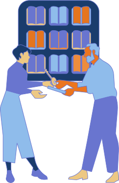

<a href="/members/" class="backhome_link">BACK HOME</a>

# Why should I become a member? 

EDRLab is much more than a development laboratory: it is a community of practice for the publishing industry, in Europe and around the world. By becoming member of EDRLab you will:

* Participate to the evolution of a real open ebook ecosystem (take it as a protection against the monopoly of proprietary platforms),
* Participate to the development of open-source software via the Readium project,
* Participate to the development of user-friendly Readium LCP DRM, especially useful for e-lending,
* Participate to the evolution of EPUB. Via EDRLab’s W3C membership:
    * you’ll get feedback on what the W3C Publishing WG is working on,
    * you’ll be able to present your ideas to the W3C Publishing WG,
* Participate to enhancements on ebook accessibility,
* Participate to EDRLab Working Groups (BDComicsManga, LCP evolutions …) and informative webinars,
* Provide strategic direction, new perspectives and your specific use cases by:
    * giving advice on prospective open source projects and other undertakings of EDRLab that may be submitted to the membership for approval,
    * participating to EDRLab Board of Director elections,
    * running and serve on the EDRLab Board of Directors,
* Network, create business partnerships with other industry members, develop expert resource contracts,
* Attend the Digital Publishing Summit at discounted member rates.

## How to Join

To become a member of EDRLab, the only requirement is to have an activity in relationship with the object of the Association. 
Standard member dues are calculated from their annual gross revenue and size. The current due structure is as follows:

|Characteristics of the organization|Member dues (tax excl.)|
|---|---|
|Non-profit organization with budget lower than 2 M€|500 €|
|Company with revenue lower than 2 M€ and less than 20 employees|500 €|
|Non-profit organization with budget larger than 2 M€; Major academic partner member|1000 €|
|Company with revenue between 2 and 10 M€ and less than 50 employees|1000 €|
|Company with revenue between 10 and 50 M€ and less than 250 employees|1800 €|
|Company with revenue larger than 50 M€ or more than 250 employees|3000 €|
|Membership organization with less than 50 members|4000 €|
|Membership organization with more than 50 members|7000 €|
|Major industrial partner member|20000 €|

*Membership becomes effective on the date of payment of the membership dues. Payment options currently include bank transfer, credit card, Paypal or chèque (in France). First year dues are payable at time of application.
*

<strong>If you want to become a member</strong>

<a href="https://www.edrlab.org/become-a-member/" class="become_member">Contact Us</a>

### Online payment
EDRLab members can pay their due online via a Credit Card (we are using Stripe).

[EDRLab Online Payment](https://www.edrlab.org/shop/)

